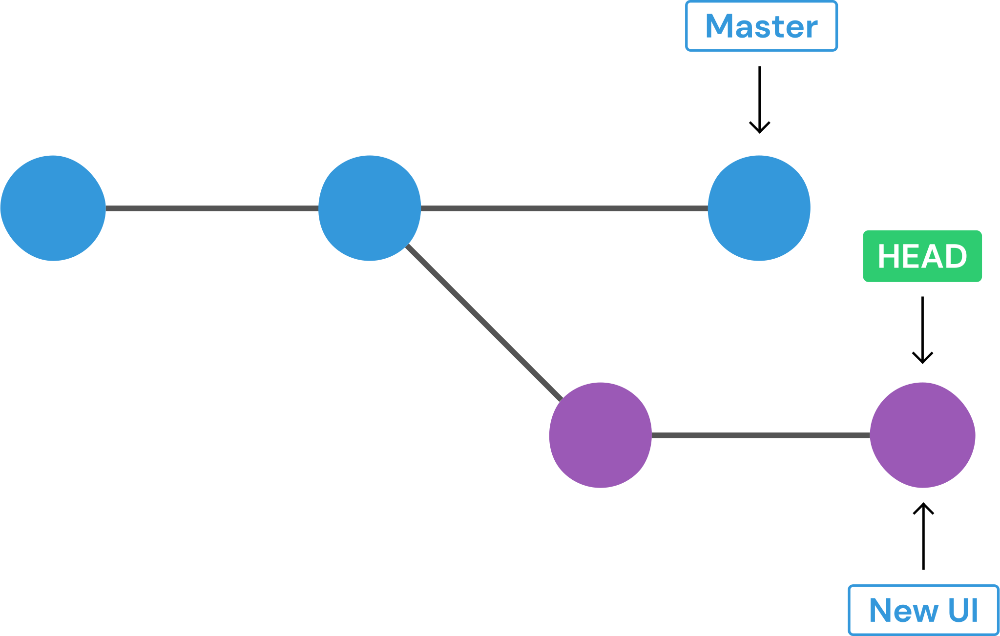
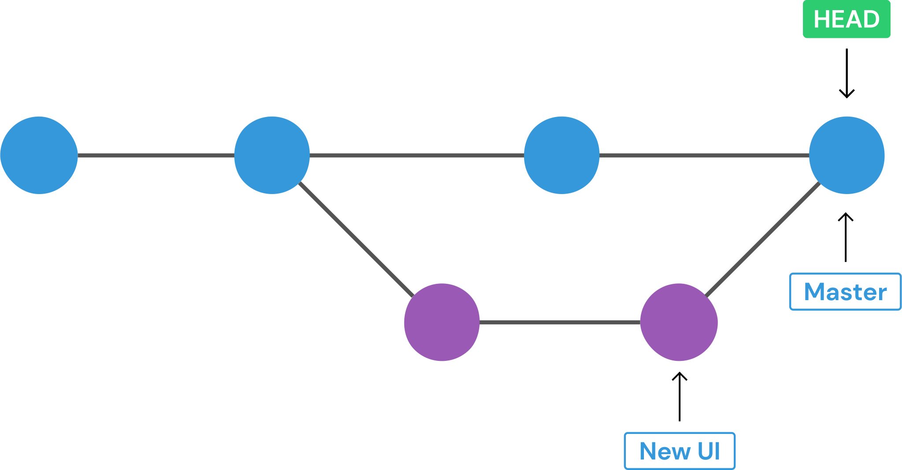

# git-cheatsheet
* **repository -** It is a workspace, which tracks changes, and manage files within the directory.

## 0. git config
* Check already set git user (if any):
```git config --get user.name```

* Check already set git email (if any):
```git config --get user.email```

* Set global git name/email
```git --global config user.name "User Name"```
```git --global config user.email "username@gmail.com"```

## 1. basics
* ```git init``` : It will initialize a directory with git, telling it to become alive and track changes in the directory, creates a **.git** folder(hidden) in your working directory.

* ```git status``` : It displays the state of your working directory, the files that are staged for tracking, and which files are not being tracked by git.
* ```git add file_1 file_2``` or ```git add .```: Add files to the staging area, for tracking them
* ```git commit -m "your_commit_message"```: Commit changes from the staging area.
* ```git log```: View summary of previous git commits

## 2. understanding a commit
* **Keep your commits atomic:** Concentrate your git commit to contain only a single feature, change, or fix, or try to keep each commit focused on a single thing.

* **Past or Present tense in git message:** According to the official docs use **Present-Tense Imperative Style**, e.g "add Login.js, do authentication". But this is so confusing. This is a debatable topic whether to use present/past tense, but for your commit messages, you can choose any way, in which you are/org is comfortable, and should follow that syntax only.

* ```git log --oneline``` : short and concise commit messages.
* ```git commit --amend -m```: ammend the previous commit, with a new message
* ```git commit --amend --no-edit```: ammend the previous commit, with the earlier message.
* ```git commit -am "commit message"``` : combined command for ```git add .``` & ```git commit -m "message"```. This adds all the files/folder except the newly created ones. For that have to first **add** and then **commit** changes.

## 3. branches
<p align='center'>

</p>

**Branches:** It allows you to create multiple timelines of your project, upon which work can be done, while unaffecting the others, which can be merged in future.
* We can make/break stuff, and that's how features are built in large companies project.

<p align='center'>

</p>

**As of now, default branch was renamed from master to main in Github, but it is still master in Git.**

**Git HEAD:** It is a pointer, which tells us our current position, on which commit we are.
**Branch HEAD** It points to the branches in the git tree, where we left off at the latest commit. It serves as references when we want to merge/checkout branches.
<p align='center'>

</p>

* ```git branch``` : shows all the branches in the project.
* ```git branch <branch_name>``` : create a new branch with the specified name, based upon the current **HEAD**.

**Branch name cannot contain spaces!**

**When you create a branch, a branch pointer is created which points to the new branch (main/master and new branch's pointer points to the same commit, when you create new branch), but the HEAD pointer still points to the master/main branch, and continues to do so, unless you switch branch.**

**When you create a branch, your previous branch pointer, your new branch's pointer and your HEAD pointer, all three commits to the same commit.**

* ```git switch <branch_name>``` : switches the branch. **(NEWER WAY of doing ```git checkout <branch_name>```, this still works.)**
* ```git switch -c <branch_name>``` : create a new branch and switch to it immediately. ```-c``` stands for **create**. Or use ```git checkout -b <branch_name>``` for the similar purpose.

**```switch``` is only used to switch branches, whereas ```checkout``` offers us additional things.**

* You can't switch branches with unstaged changes (or uncommitted changes), if you want to do so, then **commit** or **stash** your changes and then proceed.

* **A SCENARIO:** Assume that you are on a branch named *media_player*, and you created a file *video.js*, and this filename is unique, no other file with this same name is in your whole project, and if now you want to switch branches, git will not show you any error, and this file will come with you in other branches, which is not desireable. That's why it is adviced to commit/stash code before changing branches.

**When there are changes which are in conflict, e.g code in a file, then git will give us error and when there are not conflicting changes, then those changes will come with us.**

* ```git branch -d <branch_name>```: delete a branch
**To delete a branch, you must be checked out of it.**

* ```git branch -D <branch_name>```: when you try to delete a branch, git checks if you have merged this branch or not, so if the branch is not merged, git will give you error saying ```error: The branch <branch_name> is not fully merged```, so to delete forcefully a branch irrespective of its merged status, use ```-D``` which is a shorthand for ```--delete --force```.

* ```git branch -m <new_branch_name>```: rename a branch
**To rename a branch, you must be checked in it.**

**HOW GIT STORES HEAD AND OTHER BRANCHES**
* In the **.git** directory, **HEAD** file store the current HEAD location, for e.g, if you are currently in the master branch, file would be having **ref: refs/head/master** written in it. This is the **HEAD POINTER**.

* In the **.git/refs/head**, there would as many files as the number of branches you are having in your 
project, and each file would be containing the last commit hash of the last commit done in that branch. These are the **branch references or Branch HEAD**.**HEAD** alternates between these branch heads, when you do checkout/switch from one branch to another.

## 4. merging branches
In the merging,
  * **We merge branches, not specific commits**,
  * **We always merge to the current HEAD**, i.e We switch into the branch which needs to recieve changes, and then run the merge procedure from there.
  * After merging, the branch which was merged into another branch, is not deleted. It stays put, and you can delete/continue or can do whatever you want to do with it.

* There are several types of merges, let us study the most basic merge i.e **Fast-Forward Merge**.

#### Fast-Forward Merge
In this type of merge, we merge branches, where one branch is just an extension of another (parent) branch, where the parent branch (or the branch in which you want your changes to be introduced, is having no commits after, swithing into the new branch, which is to be merged with the other branch).

**SCENARIO**
* So let's assume, we just finished work on our new branch, and we want the ```new_ui``` to be merged in the master/main branch. So now our git structure is like this.
<p align='center'></p>

* Because we want our changes in the main/master branch, so lets switch into masin/master by hitting ```git switch main``` or ```git checkout main```. After doing this, our HEAD location is like this.
<p align='center'></p>

* And now the final step, ```git merge new_ui```, after which git structure is like this.
<p align='center'></p>

#### Merge Commit (The most common in larger companies)
* In this git create a new commit for us, we need to give message with -m flag or git will wait for you to enter the message in the VS code editor.

**SCENARIO**
* So let's assume, we just finished work on our new branch, and we want the ```new_ui``` to be merged in the master/main branch. So now our git structure is like this.
<p align='center'></p>

* But the ```main/master``` branch has another commits that, our ```new_ui``` is unaware and ```new_ui``` has commits that ```main/master``` is unaware of.
<p align='center'></p>

* So here, we will use ```git merge new_ui -m "merge commit message"``` or only ```git merge new_ui``` and git will open the code editor for us to enter commit message, and after this a new commit is made which consists of both the changes from our both the branches.
<p align='center'></p>

**CONFLICT in Merge Commits**
* If you encoutner any conflicts in merge commits, then go the conflicted file and edit is as per your need, whether you want to keep the changes from the current branch, or the other branch or want to keep the content from both the branches. Then after editting, make a commit with ```git commit -am "merge commit message"``` and git will create a new commit, with the merged content.

## 5. Comparing changes with Git Diff

### FAQs
**What is inside *.git* folder?**
* It contains dirs like config, description, HEAD, hooks etc, contains everything from log files to remote address, which helps git to work.

**Why to use .gitignore?**
* Ignore files and dirs/ in your repository.
