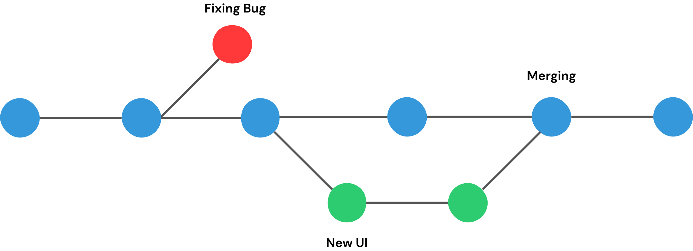
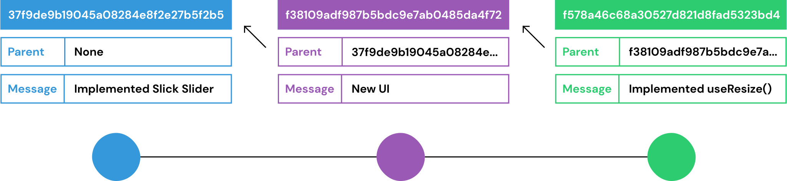
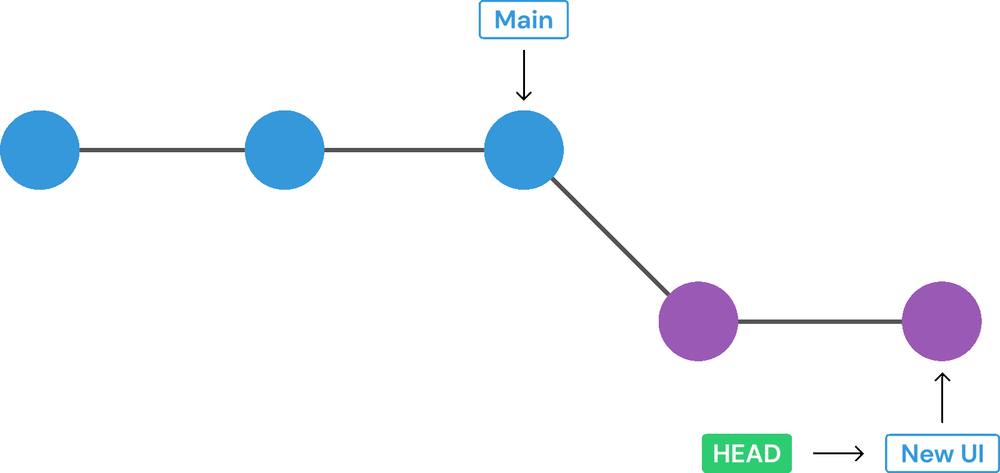
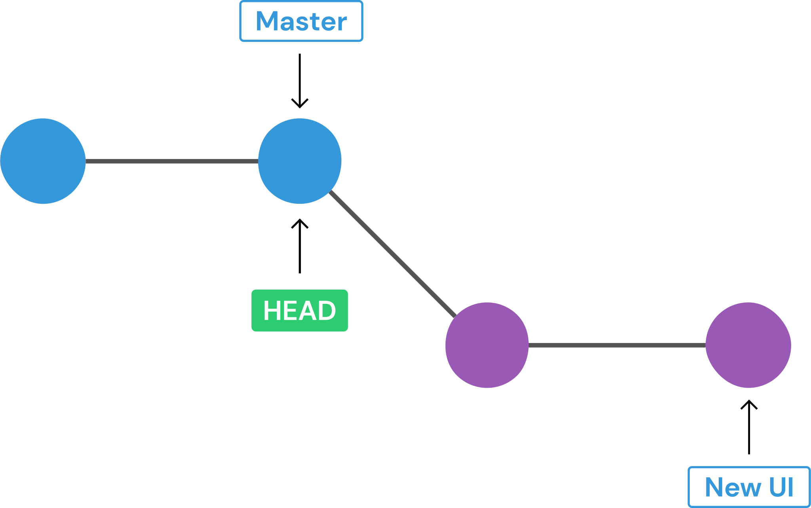
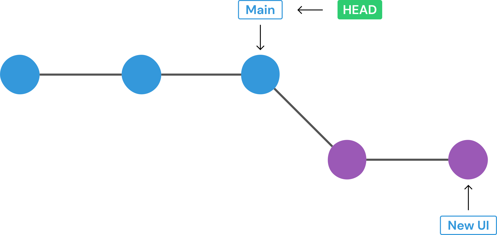
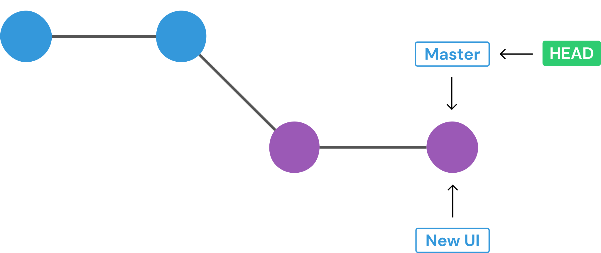
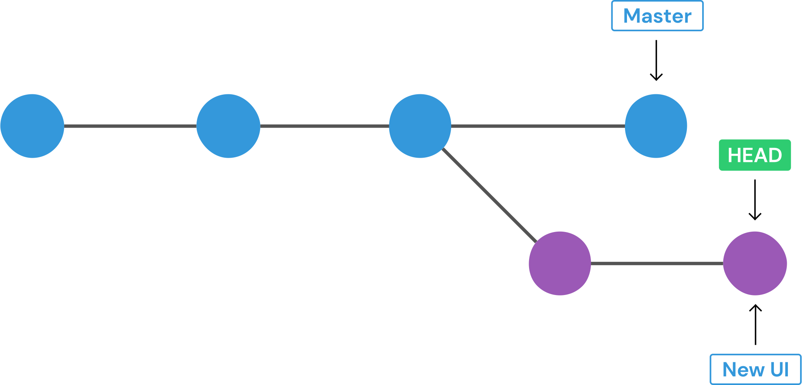
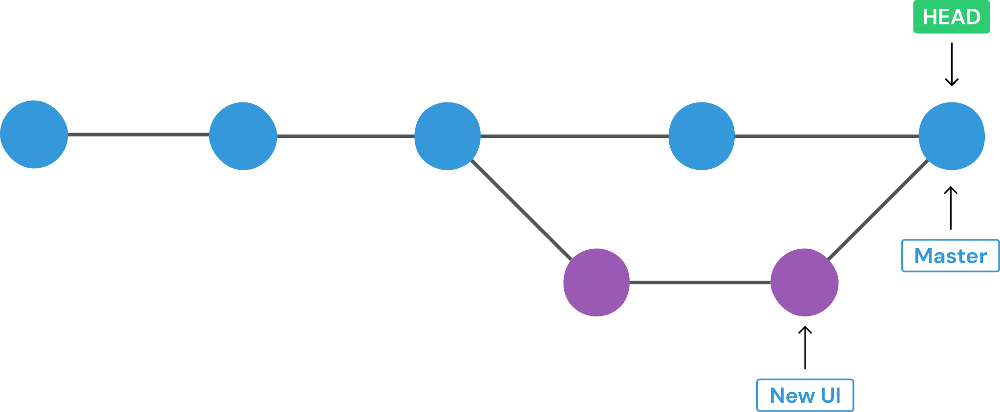
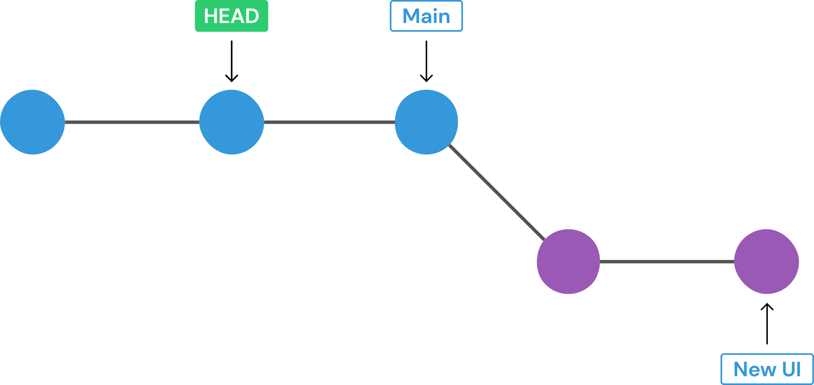
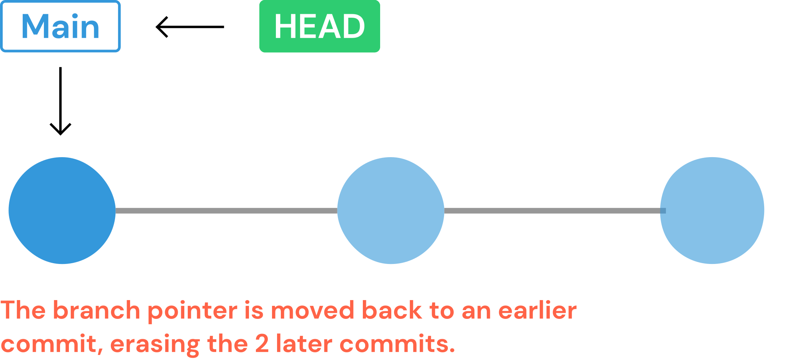

# git-cheatsheet
* **repository -** It is a workspace, which tracks changes, and manage files within the directory.

## 0. git config
* Check already set git user (if any):
```git config --get user.name```

* Check already set git email (if any):
```git config --get user.email```

* Set global git name/email
```git --global config user.name "User Name"```
```git --global config user.email "username@gmail.com"```

## 1. basics
* ```git init``` : It will initialize a directory with git, telling it to become alive and track changes in the directory, creates a **.git** folder(hidden) in your working directory.

* ```git status``` : It displays the state of your working directory, the files that are staged for tracking, and which files are not being tracked by git.
* ```git add file_1 file_2``` or ```git add .```: Add files to the staging area, for tracking them
* ```git commit -m "your_commit_message"```: Commit changes from the staging area.
* ```git log```: View summary of previous git commits

## 2. understanding a commit
* **Keep your commits atomic:** Concentrate your git commit to contain only a single feature, change, or fix, or try to keep each commit focused on a single thing.

* **Past or Present tense in git message:** According to the official docs use **Present-Tense Imperative Style**, e.g "add Login.js, do authentication". But this is so confusing. This is a debatable topic whether to use present/past tense, but for your commit messages, you can choose any way, in which you are/org is comfortable, and should follow that syntax only.

* ```git log --oneline``` : short and concise commit messages.
* ```git commit --amend -m```: ammend the previous commit, with a new message
* ```git commit --amend --no-edit```: ammend the previous commit, with the earlier message.
* ```git commit -am "commit message"``` : combined command for ```git add .``` & ```git commit -m "message"```. This adds all the files/folder except the newly created ones. For that have to first **add** and then **commit** changes.

## 3. branches
<p align='center'>

</p>

**Branches:** It allows you to create multiple timelines of your project, upon which work can be done, while unaffecting the others, which can be merged in future.
* We can make/break stuff, and that's how features are built in large companies project.

<p align='center'>

</p>

**As of now, default branch was renamed from master to main in Github, but it is still master in Git.**

**Git HEAD:** It is a pointer, which tells us our current position, on which commit we are.
**Branch HEAD** It points to the branches in the git tree, where we left off at the latest commit. It serves as references when we want to merge/checkout branches.
<p align='center'>

</p>

* ```git branch``` : shows all the branches in the project.
* ```git branch <branch_name>``` : create a new branch with the specified name, based upon the current **HEAD**.

**Branch name cannot contain spaces!**

**When you create a branch, a branch pointer is created which points to the new branch (main/master and new branch's pointer points to the same commit, when you create new branch), but the HEAD pointer still points to the master/main branch, and continues to do so, unless you switch branch.**

**When you create a branch, your previous branch pointer, your new branch's pointer and your HEAD pointer, all three commits to the same commit.**

* ```git switch <branch_name>``` : switches the branch. **(NEWER WAY of doing ```git checkout <branch_name>```, this still works.)**
* ```git switch -c <branch_name>``` : create a new branch and switch to it immediately. ```-c``` stands for **create**. Or use ```git checkout -b <branch_name>``` for the similar purpose.

**```switch``` is only used to switch branches, whereas ```checkout``` offers us additional things.**

* You can't switch branches with unstaged changes (or uncommitted changes), if you want to do so, then **commit** or **stash** your changes and then proceed.

* **A SCENARIO:** Assume that you are on a branch named *media_player*, and you created a file *video.js*, and this filename is unique, no other file with this same name is in your whole project, and if now you want to switch branches, git will not show you any error, and this file will come with you in other branches, which is not desireable. That's why it is adviced to commit/stash code before changing branches.

**When there are changes which are in conflict, e.g code in a file, then git will give us error and when there are not conflicting changes, then those changes will come with us.**

* ```git branch -d <branch_name>```: delete a branch
**To delete a branch, you must be checked out of it.**

* ```git branch -D <branch_name>```: when you try to delete a branch, git checks if you have merged this branch or not, so if the branch is not merged, git will give you error saying ```error: The branch <branch_name> is not fully merged```, so to delete forcefully a branch irrespective of its merged status, use ```-D``` which is a shorthand for ```--delete --force```.

* ```git branch -m <new_branch_name>```: rename a branch
**To rename a branch, you must be checked in it.**

**HOW GIT STORES HEAD AND OTHER BRANCHES**
* In the **.git** directory, **HEAD** file store the current HEAD location, for e.g, if you are currently in the master branch, file would be having **ref: refs/head/master** written in it. This is the **HEAD POINTER**.

* In the **.git/refs/head**, there would as many files as the number of branches you are having in your 
project, and each file would be containing the last commit hash of the last commit done in that branch. These are the **branch references or Branch HEAD**.**HEAD** alternates between these branch heads, when you do checkout/switch from one branch to another.

## 4. merging branches
In the merging,
  * **We merge branches, not specific commits**,
  * **We always merge to the current HEAD**, i.e We switch into the branch which needs to recieve changes, and then run the merge procedure from there.
  * After merging, the branch which was merged into another branch, is not deleted. It stays put, and you can delete/continue or can do whatever you want to do with it.

* There are several types of merges, let us study the most basic merge i.e **Fast-Forward Merge**.

#### Fast-Forward Merge
In this type of merge, we merge branches, where one branch is just an extension of another (parent) branch, where the parent branch (or the branch in which you want your changes to be introduced, is having no commits after, swithing into the new branch, which is to be merged with the other branch).

**SCENARIO**
* So let's assume, we just finished work on our new branch, and we want the ```new_ui``` to be merged in the master/main branch. So now our git structure is like this.
<p align='center'></p>

* Because we want our changes in the main/master branch, so lets switch into masin/master by hitting ```git switch main``` or ```git checkout main```. After doing this, our HEAD location is like this.
<p align='center'></p>

* And now the final step, ```git merge new_ui```, after which git structure is like this.
<p align='center'></p>

#### Merge Commit (The most common in larger companies)
* In this git create a new commit for us, we need to give message with -m flag or git will wait for you to enter the message in the VS code editor.

**SCENARIO**
* So let's assume, we just finished work on our new branch, and we want the ```new_ui``` to be merged in the master/main branch. So now our git structure is like this.
<p align='center'></p>

* But the ```main/master``` branch has another commits that, our ```new_ui``` is unaware and ```new_ui``` has commits that ```main/master``` is unaware of.
<p align='center'></p>

* So here, we will use ```git merge new_ui -m "merge commit message"``` or only ```git merge new_ui``` and git will open the code editor for us to enter commit message, and after this a new commit is made which consists of both the changes from our both the branches.
<p align='center'></p>

**CONFLICT in Merge Commits**
* If you encoutner any conflicts in merge commits, then go the conflicted file and edit is as per your need, whether you want to keep the changes from the current branch, or the other branch or want to keep the content from both the branches. Then after editting, make a commit with ```git commit -am "merge commit message"``` and git will create a new commit, with the merged content.

## 5. Comparing changes with Git Diff
* We can use the ```git diff``` command to view changes between commits, branches, files in our working directory and more.
* We often use ```git diff``` alogside commands like git status andgit log, to get a better picture of a repository and how it has changes over time.
* Generally git diff compares the same file, **the file structure at the time of last commit** and **the file structure present now in the working directory**. We can also differentiate different files.

* Now after running ```git diff```, you will see number of entries, comparing files, which can be like.
```diff --git a/rainbow.txt b/rainbow.txt
index 78d1d5a..f2c8117 100644
--- a/rainbow.txt
+++ b/rainbow.txt

// git does not show 1000s editted lines in the git diff, instead of that it shows the edits in chunks, and edits are denoted by the chunk header which starts and ends with @@.
// this says 4 lines were extracted starting from line number 3 and 5 lines were extracted starting from line number 3, followed by the preview, and from the next line, shows the changed text.
@@ -3,4 +3,5 @@ orange
yellow
green
blue
-purple
+indigo
+violet
```

**```git diff``` shows unstaged changes.**

* ```git diff HEAD```: It lists out all the changes in the working tree since last commit. That includes staged and unstaged changes.

* ```git diff --staged``` or ```git diff --cached```: It lists out the changes between the staging area and our last commit.

* ```git diff HEAD <file_name>```: It lists out the changes of a specific file since the last commit
* ```git diff --staged <file_name>```: It lists out the changes of a specific file from the staging area.

* ```git diff <branch_1> <branch_2>``` or ```git diff <branch_1>..<branch_2>```: Differentiates between the tips of the branch1 and branch2.

* ```git diff <commit_hash_1> <commit_hash_2>``` or ```git diff <commit_hash_1>..<commit_hash_2>```: Differentiates between 2 different commits.

## 5. Git Stash
* Git Stash lets you save your code in the git without making any commits.

**SCENARIO:**
* You commited your code in the **master** branch with **cat.py** file in it. Now you created a new branch named **dog** and created **dog.py** in it. But now for some reason, you are required to go back to **master** branch, but you dont wan't to commit in your **dog** branch now. So what happens?

 * NO CONFLICTING CHANGES: If you are having non-conflicting changes, your changes are gonna come with you in the destination branch.
 * CONFLICTING CHANGES: Git will give you error. It will say either commit your code or stash it.

* ```git stash``` or ```git stash save <message>```: It will take all your uncommitted changes (staged and unstaged) and stash them, reverting the changes in your working dir, to the previous commit.

* ```git stash pop```: Pop out the most recent stash, and re-apply the code changes in the working directory. **It removes the stashed code from the git stash memory.**

* ```git stash apply```: It re-applies the code in the same way as the git stash does, **but the stashed code is also present in the git stash.**

* ```git stash list```: List out all the stashes in the git stack of stashes.

* ```git stash apply stash@{*id*}```: Apply the specific stash in your code.

* ```git stash drop stash@{*id*}```: Drop/Delete particular stash from the stack of stashes. Comes in handy, when you are using git stash apply.

* ```git stash clear```: clear the stack of stashes completely.

## 6. Undoing changes and Time Travelling

#### Going back to a specific commit
* ```git checkout <commit_hash>```: It is equivalent to time travelling, we are jumping back to that state of code. Git log is also restored with respect to that timeline, but this also results in **DETACHED HEAD**.

#### What is DETACHED HEAD ?
* So normally what happens, the HEAD pointer refers to a branch pointer, and the branch pointer is refering to a specific commit.
<p align='center'>

</p>

* In ideal cases, the HEAD pointer never points to a commit, but when it does, then that state is called **Detached HEAD state**.
<p align='center'>

</p>

* So it is not normal, but is it good or bad?
 * Basically, we have couple of options here:
  1. You can examine the contents of the old commit. Poke around, view the files etc.
  2. Leave and go back to wherever you were before, i.e reattach your head, or
   i. use ```git switch <branch_name>```, to get your HEAD pointer, pointing back to the branch pointer.
  3. Create a new branch from there and switch to it. You can now make ans save changes, since HEAD is no longer detached.
   i. use ```git switch -c <branch_name>``` or equivalent command to create a new branch from there, and after committing your changes you can go back to the previous branch by ```git switch <branch_name>```.

##### Checkout
* ```git checkout HEAD~1```: Restore your code to one commit before the latest commit (parent).
* ```git checkout HEAD~2```: Restore your code to two commits before the latest commit (grandparent).
**This also results in detached HEAD. Use ```git switch <previous_branch_name>``` or ```git switch -```, and git will automatically take you to the previous branch name.**

* ```git checkout HEAD <filename1> <filename2>```: Discard your changes, to what it looked like the previous commit or use ```git checkout -- <filename> <filename>```.

##### Restore
* ```git restore <filename1> <filename2>```: umodify the changes in the repo we made, since the last commmit. **These changes are lost for permanent.**
* ```git restore --source HEAD~1 <filename>``` or ```git restore --source <commit_hash> <filename>```: It will restore the contents of the specified file to the state specified by the commit hash or the HEAD reference.
**This only restores code, and do not detaches HEAD, so if you use ```git restore <filename>```, it will take you file contents the commit represented by the HEAD (or the latest commit).**

* ```git restore --staged <filename1> <filename2>```: Unstage any staged files.

##### Reset
* ```git reset <commit_hash>```: It will reset the repo back to a specific commit. The commits are gone.It is used to delete commits. **It only deletes the commit however the code changes are still there in your working project, which can help you if you want to make commit in another branch but accidently committed in another branch**. If you also want to delete the associated changes, then the command is used.

* ```git reset --hard HEAD~1``` or ```git reset --har d <commit_hash>```: It will delete the last commit and associated changes.

**All changes are done in the current branch.**

##### Revert
* **git revert** is similar to **git reset**, but they both achieve this in different manner.

|```git reset```|```git revert```|
|---------------|----------------|
|It actually moves the bracnh pointer backwards, eliminating commits|It creates a brand new commit which reverses/undos the changes from a commit, because it results in a new commit, you will be prompted to enter a commit message.|
|It deletes the commit history|It preserves the commit history|
|You can prefer this when you are working on a project individually|You should prefer this when you are working with a team, like at your work.|

* What ```git reset``` does
<p align='center'>

</p>

* What ```git revert``` does
<p align="center">

</p>

* ```git revert <commit_hash>```: It reverts the changes of the last commit by creating a new commit.

**It can also results in conflict sometimes, like ```git merge```, so when it occurs you need to go each file and decide what to keep and what to remov, and then commit manually.**


**Some devs think that checkout command is overloaded, that'swhy we have ```git reset```, ```git revert```, ```git switch```, which we can also perform with ```git checkout```.**

### FAQs
**What is inside *.git* folder?**
* It contains dirs like config, description, HEAD, hooks etc, contains everything from log files to remote address, which helps git to work.

**Why to use .gitignore?**
* Ignore files and dirs/ in your repository.
